# 🔗 LinkVault


**LinkVault** es una aplicación web desarrollada como proyecto de práctica y portafolio para gestionar enlaces personales de forma organizada.

Permite registrar recursos web, clasificarlos mediante categorías y etiquetas, marcarlos como favoritos y encontrarlos rápidamente mediante filtros y búsqueda.

El proyecto fue desarrollado principalmente con **PHP, MySQL, HTML5, CSS3 y JavaScript**, sin utilizar un framework backend, con el objetivo de practicar y reforzar fundamentos de desarrollo web antes de avanzar hacia arquitecturas y frameworks más complejos.

---

## 📸 Vista general

LinkVault utiliza una interfaz oscura orientada a mantener los enlaces almacenados organizados y fácilmente accesibles.

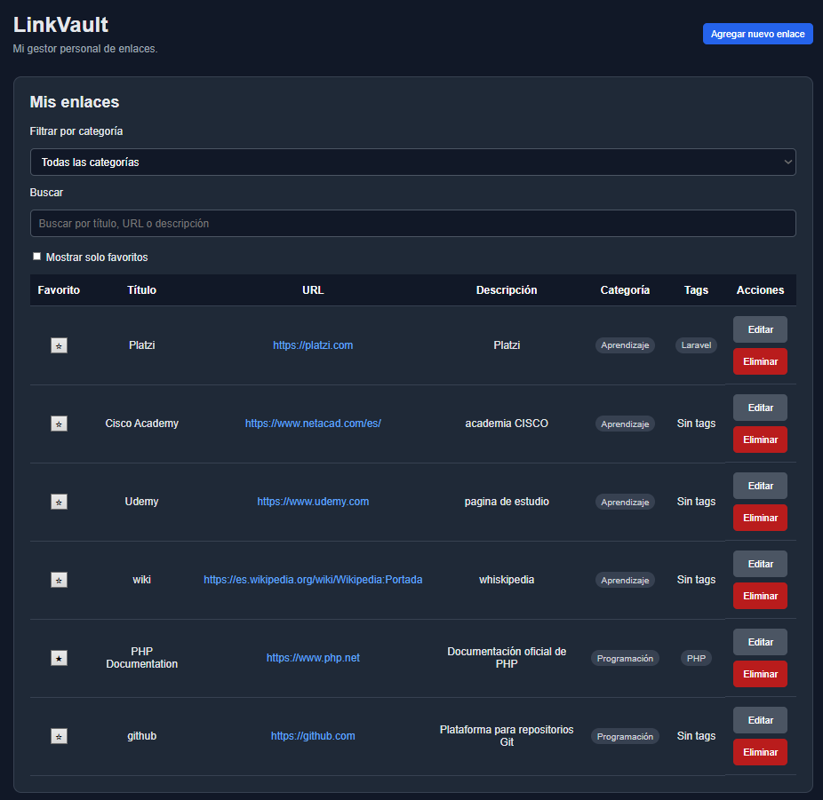

---

## ✨ Características principales

- Crear nuevos enlaces.
- Editar enlaces existentes.
- Eliminar enlaces mediante confirmación previa.
- Marcar y desmarcar enlaces como favoritos.
- Organizar enlaces mediante categorías.
- Asociar múltiples tags a cada enlace.
- Buscar enlaces por título, URL o descripción.
- Filtrar enlaces por categoría.
- Mostrar únicamente enlaces favoritos.
- Validar URLs duplicadas.
- Mostrar mensajes de confirmación después de crear, editar o eliminar.
- Persistir la información mediante MySQL.
- Utilizar consultas preparadas mediante PDO.
- Adaptar la interfaz a diferentes tamaños de pantalla.
- Mantener una interfaz visual oscura desarrollada con CSS.

---

# 🛠️ Tecnologías utilizadas

| Tecnología | Uso |
|---|---|
| **PHP** | Lógica backend, procesamiento de formularios y acceso a datos |
| **MySQL** | Persistencia y organización de datos |
| **PDO** | Comunicación entre PHP y MySQL mediante consultas preparadas |
| **HTML5** | Estructura de las vistas |
| **CSS3** | Diseño, interfaz oscura y comportamiento responsive |
| **JavaScript** | Interacciones, filtros y comportamiento dinámico |
| **Git** | Control de versiones |
| **GitHub** | Repositorio y documentación del proyecto |
| **Laragon** | Entorno de desarrollo local utilizado durante el desarrollo |

---

# 🗂️ Estructura del proyecto

```text
LinkVault/
│
├── app/
│   └── repositories/
│       ├── CategoryRepository.php
│       ├── LinkRepository.php
│       └── TagRepository.php
│
├── config/
│   ├── database.php
│   └── database.example.php
│
├── database/
│   ├── schema.sql
│   └── seed.sql
│
├── docs/
│   └── screenshots/
│       ├── 01-main-view.png
│       ├── 02-create-form.png
│       ├── 03-create-example.png
│       ├── 04-edit-form.png
│       ├── 05-create-success.png
│       ├── 06-edit-success.png
│       ├── 07-delete-confirmation.png
│       ├── 08-delete-confirmation-main.png
│       ├── 09-category-filter.png
│       ├── 10-favorites-filter.png
│       ├── 11-mobile-view.png
│       └── 12-tablet-view.png
│
├── public/
│   ├── assets/
│   │   ├── css/
│   │   └── js/
│   └── index.php
│
├── views/
│   └── links/
│       ├── create.php
│       ├── edit.php
│       └── index.php
│
├── .gitignore
└── README.md
```

`public/index.php` funciona como punto de entrada principal de la aplicación.

Los repositorios ubicados en `app/repositories/` concentran las operaciones relacionadas con los datos, mientras que las vistas ubicadas en `views/` se encargan de presentar la interfaz al usuario.

---

# 🖥️ Funcionamiento

Las siguientes capturas muestran un ejemplo completo de utilización de LinkVault.

Para demostrar las operaciones CRUD se utiliza **Código Facilito** como enlace de ejemplo.

> **Nota sobre los datos de demostración**
>
> Los nombres, URLs y referencias a sitios web o servicios externos que aparecen en las capturas, incluyendo Código Facilito, Platzi, Cisco Networking Academy, Udemy, Wikipedia, PHP y GitHub, se utilizan exclusivamente como **datos de ejemplo** para demostrar el funcionamiento de LinkVault.
>
> Su aparición en este proyecto no implica afiliación, patrocinio, colaboración, representación, aprobación ni relación oficial alguna entre LinkVault, su autor y las organizaciones o marcas mencionadas.
>
> LinkVault no utiliza sus nombres con fines comerciales ni pretende hacerse pasar por ninguno de estos servicios.

---

## ➕ 1. Crear un enlace

Al seleccionar **Agregar nuevo enlace**, LinkVault presenta un formulario desde el cual se puede registrar un nuevo recurso.

El formulario permite ingresar:

- Título.
- URL.
- Descripción.
- Tags.
- Categoría.

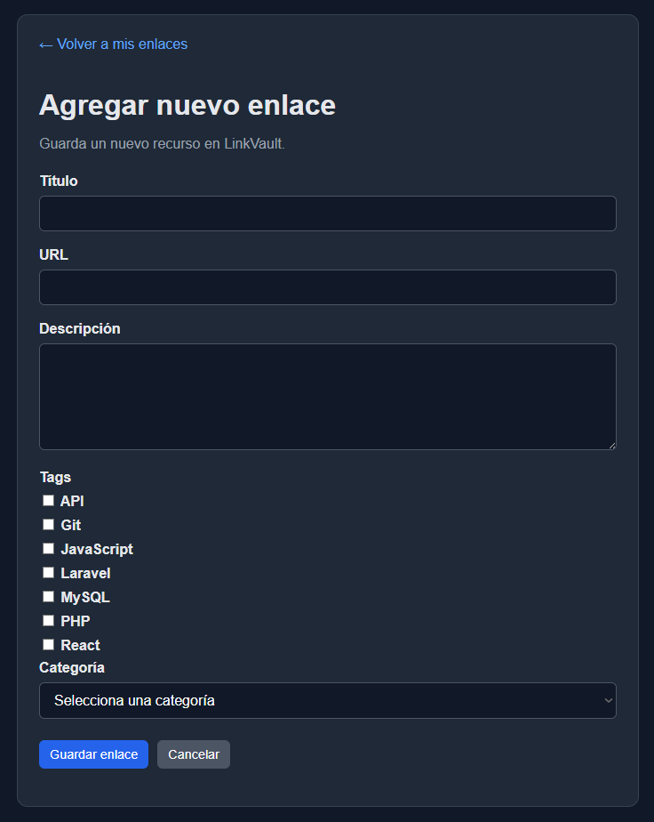

Para demostrar esta funcionalidad se utiliza **Código Facilito** como ejemplo.

En la siguiente captura se completa el formulario con una URL, una descripción, una categoría y diferentes tags.

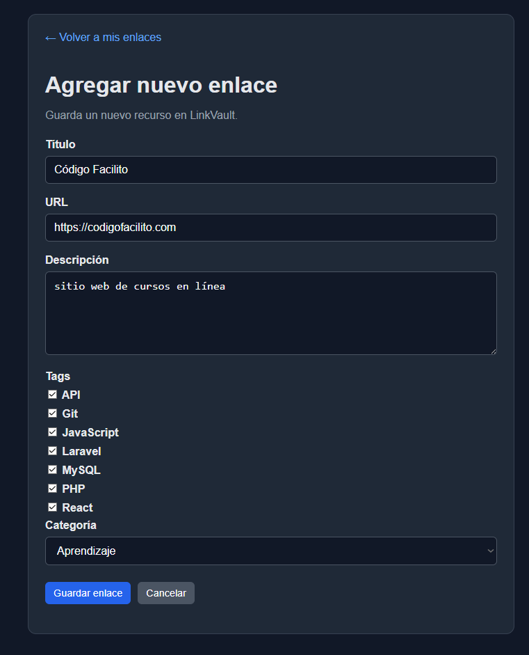

Al guardar el formulario, LinkVault almacena el nuevo registro y regresa automáticamente al listado principal.

El mensaje **“Enlace guardado correctamente”** confirma que la operación fue realizada.

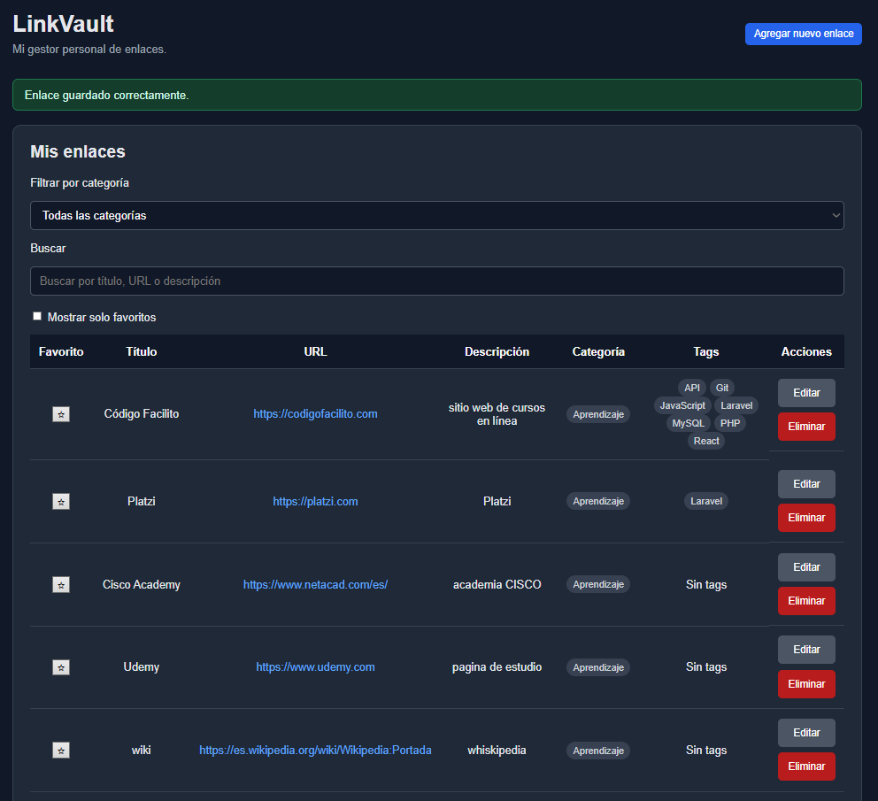

---

## ✏️ 2. Editar un enlace

Cada registro dispone de una acción **Editar**.

Al utilizarla, LinkVault recupera la información almacenada y la carga nuevamente en el formulario.

En este ejemplo se modifica el enlace de Código Facilito, incluyendo su descripción y los tags asociados.

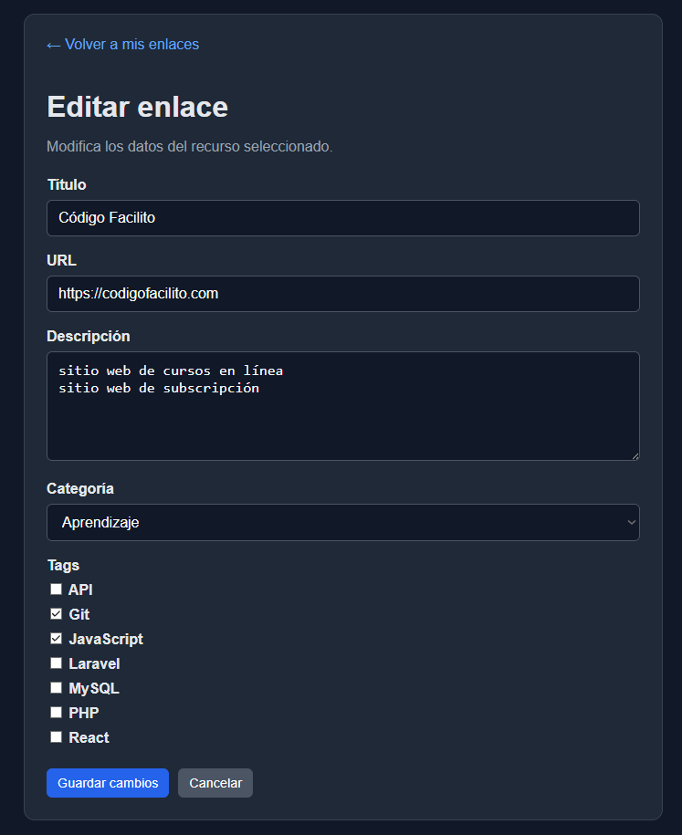

Después de guardar los cambios, la aplicación regresa al listado principal y muestra el mensaje:

**“Enlace actualizado correctamente.”**

También es posible observar inmediatamente los nuevos datos almacenados.

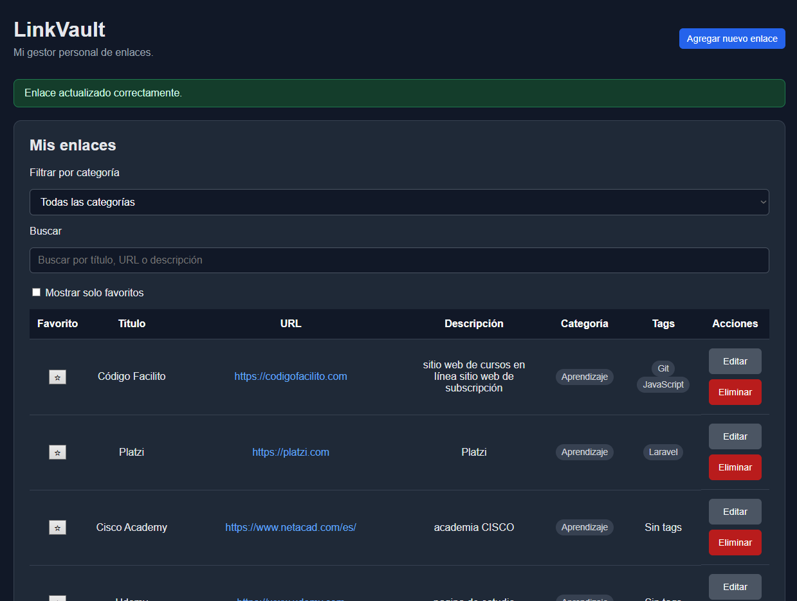

---

## 🗑️ 3. Eliminar un enlace

Para reducir el riesgo de eliminar información accidentalmente, la acción **Eliminar** no borra inmediatamente el registro.

Primero se presenta una ventana de confirmación indicando el enlace que será eliminado.

En el ejemplo se solicita eliminar el registro correspondiente a Código Facilito.

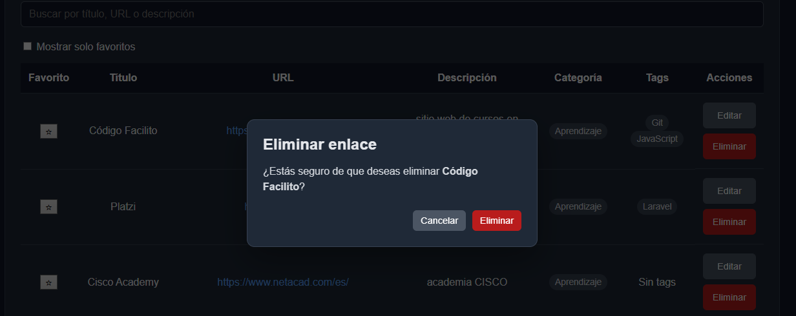

El usuario puede cancelar la operación o confirmar definitivamente la eliminación.

Después de confirmar, LinkVault elimina el registro y muestra el mensaje:

**“Enlace eliminado correctamente.”**

El enlace de Código Facilito deja entonces de aparecer en el listado.

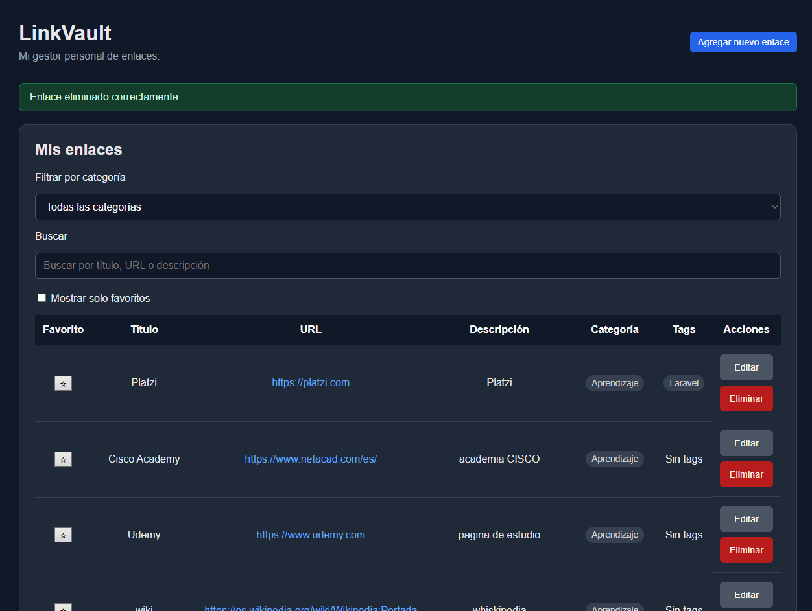

---

# 🔎 Búsqueda, categorías y favoritos

Además de las operaciones CRUD, LinkVault incorpora herramientas para facilitar la localización y organización de los enlaces almacenados.

## Categorías y búsqueda

Los enlaces pueden organizarse mediante categorías y localizarse utilizando el campo de búsqueda.

El buscador puede comparar la información introducida con los datos disponibles en los registros, facilitando la localización de un enlace específico.

En la siguiente captura se utiliza nuevamente **Código Facilito** como término de ejemplo:

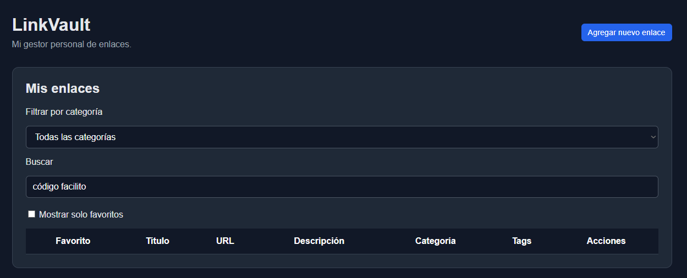

Las categorías permiten complementar esta funcionalidad agrupando los enlaces según el tipo de recurso almacenado.

---

## ⭐ Favoritos

Cada enlace puede marcarse o desmarcarse como favorito utilizando el control correspondiente.

La opción **Mostrar solo favoritos** permite ocultar temporalmente los demás registros.

En el ejemplo, el filtro deja visible únicamente el enlace marcado como favorito:

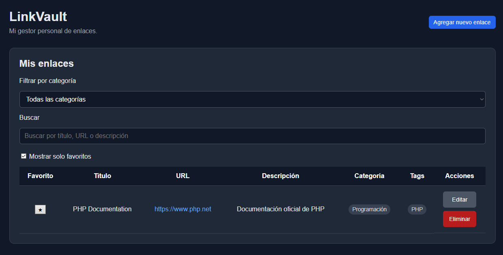

---

# 📱 Diseño responsive

LinkVault incorpora reglas CSS responsive para adaptar la interfaz a diferentes dimensiones de pantalla.

El diseño fue probado tanto en escritorio como en resoluciones representativas de dispositivos móviles y tablets.

En pantallas pequeñas:

- El encabezado reorganiza sus elementos.
- El botón principal se adapta al ancho disponible.
- Los filtros mantienen un tamaño adecuado para la pantalla.
- La tabla conserva su estructura.
- Cuando la tabla supera el ancho disponible, puede recorrerse horizontalmente para acceder a las columnas restantes.

Esta última decisión permite conservar la estructura tabular de LinkVault incluso en dispositivos estrechos, en lugar de eliminar información o transformar completamente los registros.

## Vista móvil

La siguiente captura muestra LinkVault utilizando una resolución móvil:

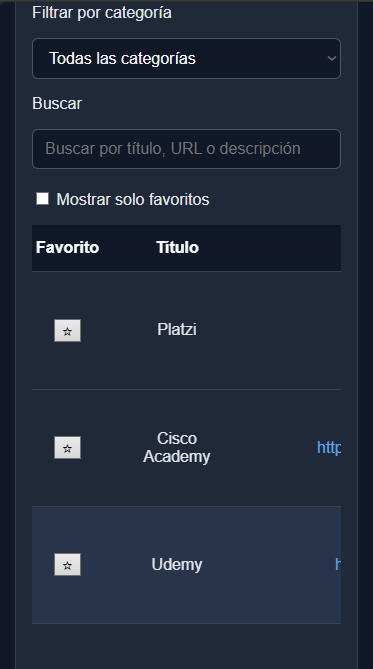

La tabla continúa siendo accesible mediante desplazamiento horizontal.

## Vista tablet

En una pantalla de mayor tamaño, la aplicación aprovecha el espacio adicional manteniendo la misma estructura general:

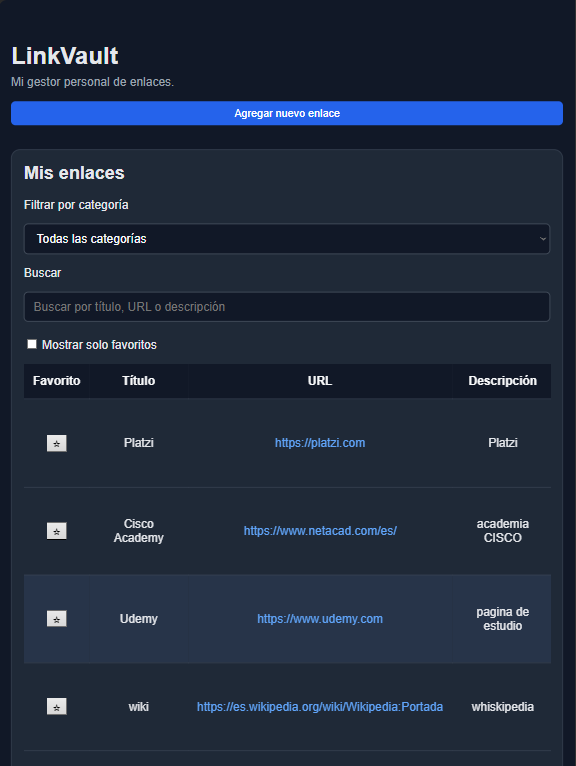

---

# 🚀 Instalación y ejecución local

## Requisitos

Para ejecutar LinkVault localmente se necesita:

- PHP.
- MySQL o MariaDB.
- Un navegador web.
- Un entorno local compatible o acceso al servidor integrado de PHP.

Durante el desarrollo del proyecto se utilizó **Laragon en Windows** para disponer fácilmente de PHP, MySQL y las herramientas necesarias para trabajar localmente.

---

## ⚠️ Nota sobre Laragon y su licencia

**Laragon es un proyecto externo e independiente de LinkVault.**

Laragon no forma parte de este repositorio, no es distribuido junto con LinkVault y mantiene sus propios términos y condiciones de uso.

Las versiones actuales de Laragon utilizan un modelo de licenciamiento definido por sus desarrolladores. Determinados usos no comerciales pueden realizarse sin adquirir una licencia comercial, mientras que el uso comercial está sujeto a las condiciones y licencias establecidas por Laragon.

LinkVault fue desarrollado utilizando Laragon únicamente como **entorno local de desarrollo y aprendizaje**.

Por este motivo, este repositorio no concede, modifica ni sustituye ningún derecho relacionado con Laragon.

Antes de instalar o utilizar Laragon, especialmente para actividades profesionales, empresariales o comerciales, se recomienda consultar la documentación y los términos de licencia oficiales vigentes del proyecto.

También es posible ejecutar LinkVault utilizando otro entorno compatible con PHP y MySQL.

---

# ⚙️ Configuración

## 1. Clonar el repositorio

```bash
git clone <URL-DEL-REPOSITORIO>
```

Ingresar posteriormente al directorio del proyecto:

```bash
cd linkvault
```

---

## 2. Preparar la base de datos

Crear una base de datos denominada:

```text
linkvault
```

Después ejecutar:

```text
database/schema.sql
```

Este archivo contiene la estructura necesaria para crear las tablas utilizadas por LinkVault.

Opcionalmente se puede ejecutar:

```text
database/seed.sql
```

para incorporar los datos iniciales incluidos con el proyecto.

---

## 3. Configurar la conexión

El proyecto incluye el archivo:

```text
config/database.example.php
```

Crear una copia con el nombre:

```text
config/database.php
```

y configurar los datos correspondientes al entorno local.

Ejemplo:

```php
$host = 'localhost';
$dbname = 'linkvault';
$user = 'root';
$password = '';
```

`database.php` representa la configuración local y no debe utilizarse para publicar credenciales privadas o reales en el repositorio.

---

# ▶️ Ejecución utilizando Laragon

El procedimiento utilizado durante el desarrollo fue el siguiente:

### 1. Iniciar Laragon

Ejecutar Laragon y comprobar que **MySQL** se encuentre iniciado.

### 2. Abrir una terminal

Desde la terminal, ingresar a la carpeta raíz de LinkVault.

Por ejemplo:

```powershell
cd "E:\Desarrollo\Portafolio\01 - LinkVault"
```

> La ruta anterior corresponde únicamente a un ejemplo de la ubicación utilizada durante el desarrollo. Cada usuario debe utilizar la ruta donde haya clonado o descargado el proyecto.

### 3. Iniciar el servidor PHP

Ejecutar:

```bash
php -S localhost:8000 -t public
```

La opción:

```text
-t public
```

establece `public/` como raíz pública del servidor.

De esta manera, `public/index.php` funciona como punto de entrada de la aplicación y los directorios internos del proyecto no se utilizan como raíz pública.

### 4. Abrir LinkVault

Desde el navegador ingresar a:

```text
http://localhost:8000
```

Si PHP, MySQL y la configuración de la base de datos están funcionando correctamente, se mostrará la página principal de LinkVault.

---

# 🧠 Objetivo del proyecto

LinkVault es principalmente un **proyecto de práctica, aprendizaje y portafolio**.

No fue desarrollado con el objetivo de competir con servicios comerciales de gestión de marcadores.

Su propósito es poner en práctica fundamentos de desarrollo web construyendo una aplicación funcional desde sus componentes básicos antes de avanzar hacia frameworks y arquitecturas de mayor nivel.

Durante su desarrollo se practicaron conceptos como:

- Organización de un proyecto PHP.
- Separación entre lógica, acceso a datos y presentación.
- Operaciones CRUD.
- Formularios y procesamiento de solicitudes.
- Acceso a MySQL mediante PDO.
- Consultas preparadas.
- Relaciones entre tablas.
- Relaciones many-to-many mediante tags.
- Categorías.
- Validación de datos.
- Prevención de URLs duplicadas.
- Patrón Post/Redirect/Get.
- Manipulación del DOM mediante JavaScript.
- Búsqueda y filtrado.
- Gestión de favoritos.
- Diseño responsive.
- Control de versiones mediante Git.
- Documentación de proyectos mediante GitHub.

---

# 🔐 Consideraciones de seguridad

LinkVault incorpora prácticas básicas de seguridad y organización apropiadas para el alcance educativo del proyecto:

- Consultas preparadas mediante PDO.
- Validación de datos recibidos desde formularios.
- Escape de información presentada en las vistas.
- Separación de la configuración de base de datos.
- Exclusión de credenciales locales mediante `.gitignore`.
- Validación de URLs duplicadas.

Al tratarse de un proyecto educativo y no de una aplicación preparada para producción, existen aspectos que podrían ampliarse posteriormente, como:

- Autenticación de usuarios.
- Autorización y roles.
- Protección CSRF.
- Gestión avanzada de sesiones.
- Registro de actividad.
- Configuración para despliegue en producción.
- Pruebas automatizadas.

---

# 📌 Estado del proyecto

**Estado actual: funcional — proyecto de práctica y portafolio.**

Las principales funcionalidades planificadas se encuentran implementadas:

**CRUD + categorías + tags + favoritos + búsqueda + filtros + persistencia MySQL + diseño responsive.**

El proyecto puede continuar evolucionando a medida que se incorporen nuevos conocimientos y funcionalidades.

---

# 👨‍💻 Autor

**Carlos Orellana**

Analista Programador.

Proyecto desarrollado como parte de un portafolio personal orientado a reforzar y demostrar conocimientos de desarrollo web.

---

# 📄 Licencias y marcas de terceros

LinkVault es un proyecto personal de aprendizaje y portafolio.

Las herramientas, tecnologías, sitios web, servicios, nombres comerciales y marcas mencionados pertenecen a sus respectivos propietarios.

Las referencias utilizadas dentro de los datos de demostración tienen exclusivamente una finalidad ilustrativa y educativa y **no representan afiliación, patrocinio ni relación comercial** con este proyecto o su autor.

Las herramientas externas utilizadas durante el desarrollo, incluyendo Laragon, mantienen sus propias licencias y términos de uso.
